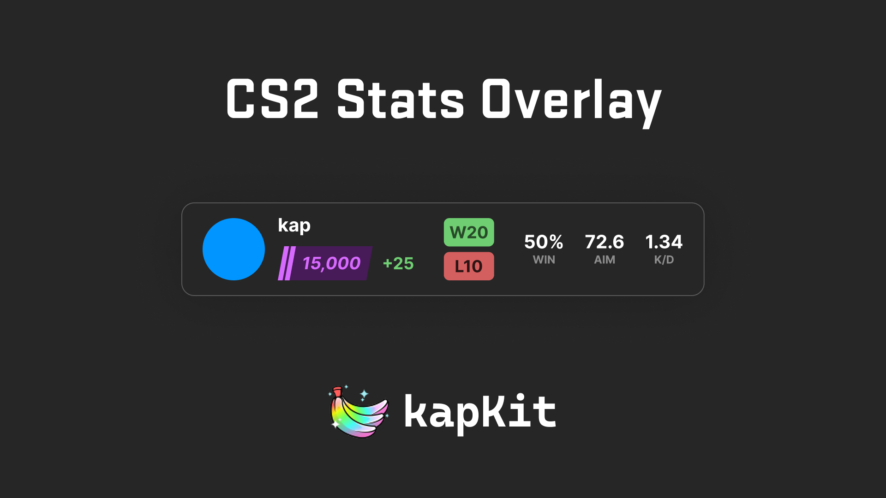

<div align="center">



# CS2 Stats Overlay

An OBS browser-source widget that shows your CS2 Premier rating, rank badge, <br/> stats, and recent match history — powered by the Leetify API.

**Free & open source** · Built with [TypeScript](https://www.typescriptlang.org) and [Vite](https://vitejs.dev)

[](LICENSE)
[](https://www.typescriptlang.org)
[](https://github.com/sidkapahi/cs2-stats-overlay/pulls)

**[Open Customizer](https://sidkapahi.github.io/cs2-stats-overlay/)** · **[Figma Design](https://www.figma.com/design/5JQex6PZfwQGDoB4D3SrAl/CS2-Stats-Overlay)** · **[Report a Bug](https://github.com/sidkapahi/cs2-stats-overlay/issues)**

</div>

> [!WARNING]
> **This project was built with AI assistance (vibe coded).** While it works, the
> code hasn't been professionally audited — use at your own risk. If you get a
> chance, feel free to review the code before deploying. PRs and fixes are always
> welcome. Thank You!

## Overview

CS2 Stats Overlay renders a compact, transparent stats card you can drop straight
into OBS as a Browser Source. Data is fetched live from the
[Leetify API](https://leetify.com), and the layout follows the
[CS2 Stats Overlay Figma design](https://www.figma.com/design/5JQex6PZfwQGDoB4D3SrAl/CS2-Stats-Overlay).

- **Live Premier rating** with a per-tier **rank badge** (Gray, Light Blue, Blue,
  Purple, Pink, Red, Gold) — or a plain rank-coloured number when the badge is off
- **Rank-point change** from your last Premier match (e.g. `+250`)
- **Win / loss pills** and core stats: win rate, aim rating, K/D
- **Recent match-history strip** (W / L / T)
- **Customizer UI** to configure options and generate widget URLs
- **Auto-refresh** on a configurable interval
- **Transparent background** — works on any stream layout

## Getting Started

```bash
npm install
cp .env.example .env.local   # then paste your Leetify Public API key
npm run dev
```

The customizer runs at `http://localhost:5173/` and the widget at `http://localhost:5173/widget/`.

`VITE_LEETIFY_KEY` is optional locally — without it, requests still work but hit
Leetify's stricter unauthenticated rate limits. For the deployed site, set the
same name as a **GitHub Actions repository secret** (Settings → Secrets and
variables → Actions) so it's injected into the build.

## Requirements

- **Leetify account** with match tracking enabled — create one at
  [leetify.com](https://leetify.com) and make sure your profile is connected to Steam
- **Matchmaking share code** — required for Leetify to automatically sync your
  matches. Without it, data updates will be delayed.
  1. Get your Authentication Code from [Steam](https://help.steampowered.com/en/wizard/HelpWithGameIssue?appid=730&issueid=128)
  2. Enter it on Leetify's [Data Sources](https://leetify.com/app/data-sources) page under the Matchmaking tab
  3. Once active, Leetify will pick up your matches shortly after they finish
- **Steam64 ID or profile link** — paste your Steam profile URL straight into
  the customizer and it pulls out the Steam64 ID for you. A
  `steamcommunity.com/profiles/…` link (or a raw Steam64 ID) works out of the
  box; a custom `steamcommunity.com/id/…` link needs the optional Steam proxy
  Worker deployed (see below). You can still look up a raw ID at
  [steamid.io](https://steamid.io) if you prefer.

## Usage

1. Open the [customizer](https://sidkapahi.github.io/cs2-stats-overlay/)
2. Enter your Steam64 ID or paste your Steam profile link
3. Toggle display options (avatar, name, rank badge, rank change, stats, match history)
4. Set the number of recent matches and refresh interval
5. Copy the generated widget URL
6. In OBS, add a **Browser Source** and paste the URL
7. Set the recommended size to **660 × 180** (adjust as needed)

## Query Parameters

The widget URL supports these parameters:

| Parameter    | Default | Description                        |
| ------------ | ------- | ---------------------------------- |
| `steamId`    | —       | Steam64 ID (required)              |
| `avatar`     | `1`     | Show avatar (`0` to hide)          |
| `name`       | `1`     | Show player name                   |
| `badge`      | `1`     | Show rank badge (`0` for plain)    |
| `change`     | `1`     | Show rank-point change (+/-)       |
| `stats`      | `1`     | Show WIN%, AIM, K/D                 |
| `history`    | `1`     | Show W/L/T match history            |
| `matchCount` | `10`    | Number of recent matches           |
| `refresh`    | `60`    | Refresh interval in seconds        |

## Player Avatars & custom profile links (optional)

Leetify's public API doesn't return a player avatar, and this static site can't
call Steam's Web API directly (it needs a secret key and sends no CORS headers).
The small Cloudflare Worker in [`worker/`](./worker) covers both: it fetches
avatars **and** resolves custom `steamcommunity.com/id/…` profile links to a
Steam64 ID. Deploy it and set `VITE_AVATAR_PROXY_URL` to its URL — full steps in
[worker/README.md](./worker/README.md). Your Steam API key stays on the Worker
and never reaches the browser. Skip this and the widget still runs — just without
avatars, and custom-URL links must be entered as a Steam64 ID or a
`/profiles/…` link instead.

## Tech Stack

| Tool | Purpose |
| ---- | ------- |
| [TypeScript](https://www.typescriptlang.org) | Application logic |
| [Vite](https://vitejs.dev) | Multi-page build & dev server |
| [Leetify API](https://leetify.com) | Live CS2 stats & match data |
| [Cloudflare Workers](https://workers.cloudflare.com) | Optional avatar proxy |

## License

[MIT](LICENSE) © Sid
